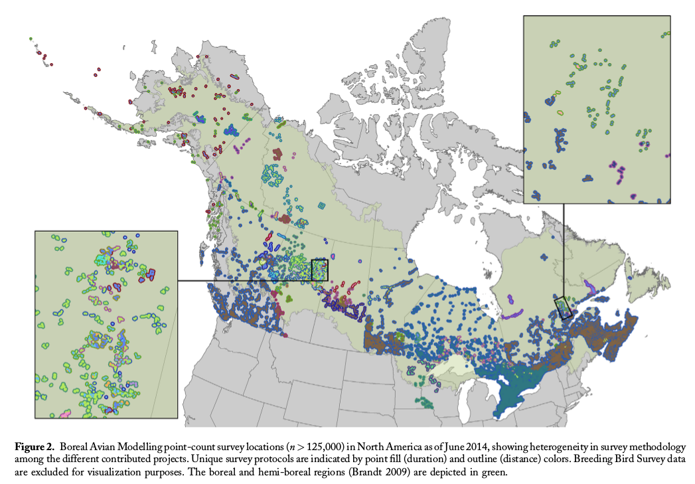
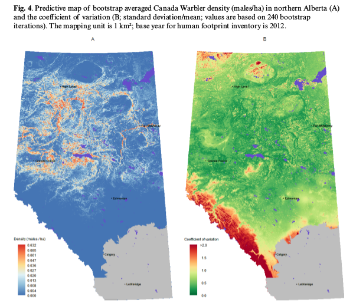

## Population size from point counts

$\hat{N} = A_{REGION} \times D$

$\hat{N} = A_{REGION} \times E[Y] \times C \times (1/\pi r^2)$

* $Y$: observed count,
* $D$: population density,
* $r$: (effective) counting distance,
* $C$: adjustments (time, pair).

***

## PIF v1.0 -- Rosenberg & Blancher 2005

0. **Pair adjustment**: $P=2$.
1. **Time adjustment**: adjust mean counts relative to the
  yearly and daily maximum for counts ($T$).
2. **Maximum detection distance**: species-specific 
  maximum detection distance ($MDD$) that birds can be heard or seen by observers.
3. **Roadside counts**: roadside-survey counts are equivalent to survey counts in off-road areas.
4. **Habitat sampling**: BBS routes sample avian habitats in proportion to their availability (extrapolation in the north, where outside of BBS coverage).

$\hat{N}^{(PIF)} = A \times E[Y^{(ROAD)}]  \times T \times P \times (1/\pi MDD^2)$

***

## Criticism -- Thogmartin et al. 2006

0. **Pair adjustment**: unpaired/floater birds not accounted for.
1. **Time adjustment**: wobbly tails of polynomial fit.
2. **Maximum detection distance**: broad distance categories, ignores habitat related variation.
3. **Roadside counts**: roads influencing behaviour.
4. **Habitat sampling**: habitats are not proportionally sampled.

Thogmartin 2010: estimates were most sensitive to MDD

***

## PIV v2.0 -- Blancher et al. 2013

0. **Pair adjustment**: species specific adjustment.
1. **Time adjustment**: stepwise polynomial.
2. **Maximum detection distance**: adjusted, more categories.
3. **Roadside counts**: roads influencing behaviour.
4. **Habitat sampling**: atlas counts used in the North (not extrapolated).

Population estimates are conservative (Matsuoka et al. 2012)

***

## Boreal Avian Modelling Project

```{r echo=FALSE,out.width="240px"}

```

Comprehensive dataset, quantitative techniques $\rightarrow$ inform broad scale policy & management for boreal birds (Barker et al. 2015).

***

## QPAD -- Solymos et al. 2013

1. **Time adjustment**: time varying removal sampling (availability for sampling, $p$).
2. **Effective detection radius**: distance sampling, species/habitat specific $EDR$.
3. **Roadside counts**: combined roadside and off-road surveys with correction factor, excluded highways.
4. **Habitat sampling**: combined roadside and off-road surveys, model based prediction with spatial smoothing.

$\hat{N}^{(QPAD)} = A \times E[Y] \times (1/p_{3}) \times (1/\pi EDR^2)$.

***

## Population sizes in Alberta

```{r echo=FALSE,out.width="250px"}

```

Predictive density modeling, Ball et al. 2016.

***

## PIF vs. QPAD Estimates in Alberta


```{r echo=FALSE,message=FALSE,results='hide',warning=FALSE}
library(knitr)

bounded_density <- function(x, interval=c(-Inf, Inf), ...) {
    require(intrval)
    interval <- sort(interval[1L:2L])
    if (!all(x %()% interval))
        stop("found values of x outside of open interval")
    a <- interval[1L]
    b <- interval[2L]
    bounds  <- is.finite(interval)
    if (!bounds[1L] && !bounds[2L]) { # (Inf, Inf)
        f <- finv <- function(x) x
    }
    if (bounds[1L] && !bounds[2L]) { # (a, Inf)
        f <- function(x)
            log(x-a)
        finv <- function(z)
            exp(z) + a
    }
    if (!bounds[1L] && bounds[2L]) { # (Inf, b)
        f <- function(x)
            log(b-x)
        finv <- function(z)
            b-exp(z)
    }
    if (bounds[1L] && bounds[2L]) { # (a, b)
        f <- function(x)
            qlogis((x-a) / (b-a))
        finv <- function(z)
            plogis(z) * (b-a) + a
    }
    fx <- f(x)
    d <- density(fx, ...)
    v <- d$x
    dv <- diff(v)
    h <- d$y
    n <- length(h)
    dh <- rowMeans(cbind(h[-n], h[-1L]))
    A <- dv * dh
    vinv <- finv(v)
    hinv <- A / abs(diff(vinv))
    hinv <- c(hinv[1L], hinv)
    data.frame(x=vinv, y=hinv)
}

if (FALSE) {
x <- rnorm(100)

op <- par(mfrow=c(2,2))
range(x)
d1 <- bounded_density(exp(x))
d2 <- bounded_density(exp(x), c(0, Inf))
plot(bounded_density(x, type="l"))

range(exp(x))
d1 <- bounded_density(exp(x))
d2 <- bounded_density(exp(x), c(0, Inf))
plot(d1, type="l", ylim=c(range(d1$y, d2$y)))
lines(d2, col=2)

range(plogis(x)*4-1)
d1 <- bounded_density(plogis(x)*4-1)
d2 <- bounded_density(plogis(x)*4-1, c(-1, 3))
plot(d1, type="l", ylim=c(range(d1$y, d2$y)))
lines(d2, col=2)

range(-exp(x)+3)
d1 <- bounded_density(-exp(x)+3)
d2 <- bounded_density(-exp(x)+3, c(-Inf, 3))
plot(d1, type="l", ylim=c(range(d1$y, d2$y)))
lines(d2, col=2)
par(op)
}

cp1 <- function(x, p=c(0, 1), nmin=5, interval=c(-Inf, Inf), ...) {
    x2 <- x[!is.na(x)]
    q <- quantile(x2, p)
    x2 <- x2[x2 > q[1] & x2 < q[2]]
    if (length(unique(x2)) < nmin) {
        m <- mean(x2)
        s <- sd(x2)
        v <- seq(min(min(x2), m-4*s), max(max(x2), m+4*s), length.out = 512)
        v <- v %()% interval
        d <- dnorm(v, m, s)
        v <- c(v[1L], v, v[length(v)])
        d <- c(0, d, 0)
        out <- data.frame(h=v, w=d/max(d))
    } else {
        d <- bounded_density(x2, interval=interval, ...)
        out <- data.frame(h=d$x, w=d$y/max(d$y))
    }
    out
}
carrot <- function(x, p=c(0,1),
col="#FF664D80", border="#FF664D",
#col="#40E0D180", border="#40E0D1",
ylim, ylab="", xlab="", main="", nmin=5, interval=c(-Inf, Inf), ...) {
    xx <- apply(x, 2, cp1, p=p, nmin=nmin, interval=interval, ...)
    if (missing(ylim))
        ylim <- range(x, na.rm=TRUE)
    plot(0, type="n", axes=FALSE, ann=FALSE, xlim=c(0.5, ncol(x)+0.5),
        ylim=ylim)
    axis(1, 1:ncol(x), colnames(x), lwd=0)
    axis(2)
    title(ylab=ylab, xlab=xlab, main=main)
    for (i in 1:ncol(x)) {
        if (!is.null(xx[[i]])) {
            polygon(0.45*c(-xx[[i]]$w, rev(xx[[i]]$w))+i,
                c(xx[[i]]$h, rev(xx[[i]]$h)), col=col, border=border)
            #lines(c(i,i), range(xx[[i]]$h), col=col, lwd=2)
        }
        lines(c(i-0.2, i+0.2), rep(median(x[,i], na.rm=TRUE), 2), lwd=3)
    }
    #points(1:ncol(x), colMeans(x, na.rm=TRUE), pch=21, cex=1.5)
    invisible(NULL)
}
pop <- read.csv("~/Dropbox/bam/PIF-AB/qpad-pif-results.csv")
rownames(pop) <- pop$Species_ID
rnd <- runif(nrow(pop), -0.1, 0.1)
```

```{r pop-size,echo=FALSE,fig.width=6,fig.height=4}
par(las=1)
boxplot(pop[,c("Npif", "Nqpad")], col=NA, range=0, ylab="M singing inds.")
for (i in 1:nrow(pop))
    lines(c(1,2), pop[i,c("Npif", "Nqpad")], col="#FF664D40")
points(1+rnd, pop[,"Npif"], col="#FF664D80", pch=19)
points(2+rnd, pop[,"Nqpad"], col="#FF664D80", pch=19)
boxplot(pop[,c("Npif", "Nqpad")], range=0, add=TRUE, col=NA)
```

***

## PIF vs. QPAD Components


$\frac{\hat{N}^{(QPAD)}}{\hat{N}^{(PIF)}} = (\frac{Y}{Y^{(ROAD)}}) \times (\frac{1/p_{3}}{T}) \times (\frac{1/\pi EDR^2}{1/\pi MDD^2}) \times \delta_{RESIDUAL}$

```{r echo=FALSE,fig.width=6,fig.height=4,message=FALSE,warning=FALSE}
par(las=1)
mat <- log(pop[,c("DeltaRoad", "DeltaTime", "DeltaDist", "DeltaRes")])
if (FALSE) {
boxplot(mat, range=0, col=NA, ylab="bias")
for (i in 2:ncol(mat))
    segments(x0=i+rnd-1, x1=i+rnd, y0=mat[,i-1], y1=mat[,i], col="#00000020")
for (i in 1:ncol(mat))
    points(i+rnd, mat[,i], col="#00000040", pch=19)
abline(h=0, col=2, lwd=2)
boxplot(mat, range=0, add=TRUE, col=NA)
}
carrot(mat, ylab="log(QPAD / PIF)")
for (i in 2:ncol(mat))
    segments(x0=i-1, x1=i, y0=mat[,i-1], y1=mat[,i], col="#00000020")
abline(h=0, col=1, lwd=1)
```

***

1. **Time related bias**: on average positive, but relatively small,
  compared to the other components.
2. **Distance related bias**: high for all species, 
  consistent with Matsuoka et al. (2012).
3. **Road related bias**: large
  variation across species with close to 0 median.
4. **Residual bias** large
  variation across species, largely negative.

**But what does residual bias represent?**

***

## Residual Bias

**R**oad **A**voidance **I**ndex:
$RAI = 1-\sum^{H}_{h=1} R_{h} O_{h}$

* $O_{i}$ is proportion of predicted population expected in habitat
class $h$,
* $R_{h}$ is proportion of roadside samples within habitat class $h$.
* centering around *road* as a species ($RAI_{ROAD}=0.73$).

***

## Habitat sampling bias

```{r echo=FALSE,fig.width=6,fig.height=5}
par(las=1)
with(pop, plot(RAIc, log(DeltaRes), type="n", 
    xlab="Centered Road Avoidance Index"))
abline(h=0, v=0, col=1, lty=2)
abline(lm(log(DeltaRes) ~ RAIc, pop), col=1)
with(pop, text(RAIc, log(DeltaRes), rownames(pop), cex=0.65, col="#FF664D"))
```

***

## Examples

Million singing individuals estimated in BCR 6 Alberta.

```{r echo=FALSE}
ss <- c("ALFL", "AMRO", "CAWA", "YRWA")
kable(pop[ss,c("English_Name", "Npif", "Nqpad")], digits=3)
```

***

## Effects are not independent


+----------------+--------------+--------------+-------------------+
| Source of bias | Density      | Area         | Other adjustments |
+================+==============+==============+===================+
| Time           |              |              | \Checkmark        |
+----------------+--------------+--------------+-------------------+
| Distance       |              | \Checkmark   | ($A$ known)       |
+----------------+--------------+--------------+-------------------+
| Roadside       | \Checkmark   | \Checkmark   |    ?              |
+----------------+--------------+--------------+-------------------+
| Habitat        | \Checkmark   | \Checkmark   |                   |
+----------------+--------------+--------------+-------------------+

***

## In progress

* **Removal models**: individual heterogeneity, geographic gradients.
* **Traits & phylogeny**: predict singing rates and EDR.
* **Roadside bias**: numeric response, behaviour, detection process.
* **ARU data integration**: https://www.ace-eco.org/issues/view.php?sf=5.
* **Species with large home ranges**: density estimation when PC area $\ll$ home range

***

## Phylogeny and species traits predict bird detectability

```{r echo=FALSE}
knitr::include_graphics("images/Fig2.pdf")
```

Under review.

***

## Key references

```{r echo=FALSE}
knitr::asis_output("\\footnotesize")
```

* **Matsuoka et al. 2012**. Using binomial distance-sampling models to estimate the effective detection radius of point-counts surveys across boreal Canada. _Auk_ 129:268--282.
* **[Solymos et al. 2013](http://onlinelibrary.wiley.com/doi/10.1111/2041-210X.12106/abstract)**. Calibrating indices of avian density from non-standardized survey data: making the most of a messy situation. _Methods  Ecol. Evol._ 4:1047--1058.
* **[Stralberg et al. 2015](http://www.esajournals.org/doi/abs/10.1890/13-2289.1)**. Projecting boreal bird responses to climate change: the signal exceeds the noise. _Ecol. Appl._ 25:52--69.
* **[Ball et al. 2016](http://www.ace-eco.org/vol11/iss2/art10/ACE-ECO-2016-916.pdf)**. Regional habitat needs of a nationally listed species, Canada Warbler *Cardellina canadensis*, in Alberta, Canada. _Avian Conserv. Ecol._ 11(2):10.
* **Solymos 2016**. QPAD version 3 documentation. Technical Report, http://www.borealbirds.ca/.

***

## Acknowledgements

```{r echo=FALSE}
knitr::asis_output("\\footnotesize")
```

Boreal Avian Modelling (BAM) Project is an international research collaboration on the ecology, management, and conservation of boreal birds. We acknowledge BAM's members, avian and biophysical data partners, and funding agencies (including Environment and Climate Change Canada and the U.S. Fish & Wildlife Service), listed in full at http://www.borealbirds.ca/index.php/acknowledgements.
