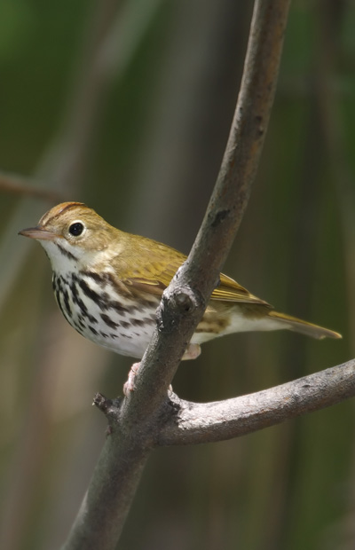
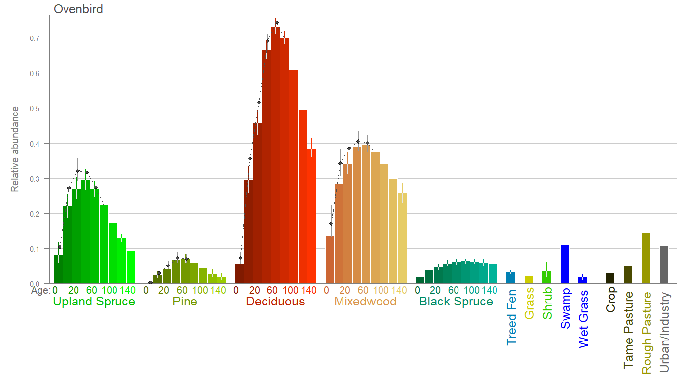
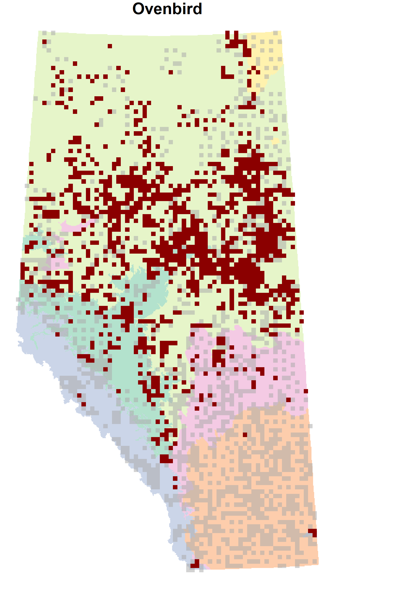
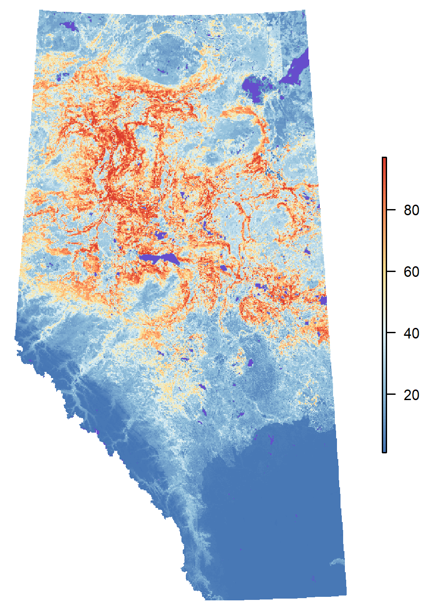

```{r preamble,include=FALSE}
library(mefa4)
library(intrval)
library(knitr)
source("~/repos/abmianalytics/birds/00-functions.R")
knitr::opts_chunk$set(cache=TRUE)
load("d:/abmi/AB_data_v2018/data/analysis/birds/ab-birds-all-2018-11-29.RData")
```

# Introduction

The Ovenbird (_Seiurus aurocapilla_; Figure \@ref(fig:oven)) is a small but loud insectivorous songbird found throughout forested regions of Alberta, 
preferring mature/old hardwood and mixedwood forests for nesting[^1].
Ovenbirds have a relatively wide breeding range that spreads from eastern British Columbia to Quebec and Newfoundland. It is migratory species wintering in Mexico, Central America, Florida, and the Caribbean 
islands[^2].

Its conservation status is secure based on AB Wildlife Act and AEP general status 2015.
Ovenbirds have become a model organism for understanding the effects of habitat fragmentation and 
forest harvest on songbirds.
We chose this species as an example because it is one of the most studied boreal songbird species,
and it represents upland bird communities preferring mature and old grofth forests.

[^1]: Mahon et al. 2016

[^2]: BNA website: Porneluzi, P., M. A. Van Horn, and T. M. Donovan (2011). Ovenbird (_Seiurus aurocapilla_), version 2.0. In The Birds of North America (A. F. Poole, Editor). Cornell Lab of Ornithology, Ithaca, NY, USA. https://doi.org/10.2173/bna.88

```{r oven,echo=FALSE,fig.cap='Ovenbird (Seiurus aurocapilla).',out.width='50%'}

```


## Habitat associations

Figure \@ref(fig:plot-hab) shows habitat associations

```{r plot-hab,echo=FALSE,fig.cap='Habitat associations of Ovenbird in .',out.width='100%'}

```

## Spatial distribution

Figure \@ref(fig:plot-det) shows detections, 
Figure \@ref(fig:plot-cr) shows current distr.


```{r plot-det,echo=FALSE,fig.cap='Current map.',out.width='50%'}

```

```{r plot-cr,echo=FALSE,fig.cap='Current map.',out.width='50%'}

```


# Local impacts

Describe here local impacts in order of OSR development chain

## Access roads and road verges

Bring in roadside effects, possibly bSims

## Seismic lines

Truncated gradient

Condor paper results

## Industrial facilities

Discuss estimates, possibly relative to regional average (i.e. under HF SE)

## Well pads

Truncated gradient

Condor paper results

## Mines

veg, pond ,active

## Pipelines and power lines

Truncated gradient

Condor paper results

# Comparing direct impacts

Additive sector effects: talk about regional, under HF, and unit effects here

# Landscape level effects

Show SSH and km_HF results based on actual landscapes from prediction

# Direct and indirect impacts

Bit unclear yet what to do here

# Appendix: Methods

Describe here all the methods


